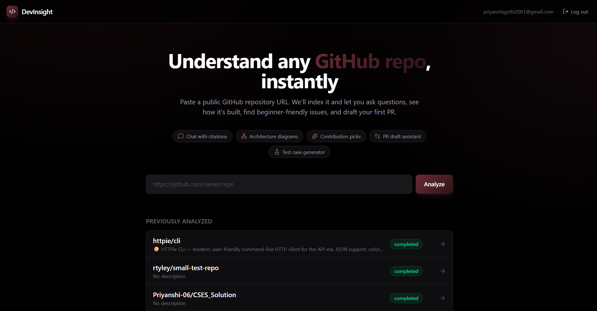
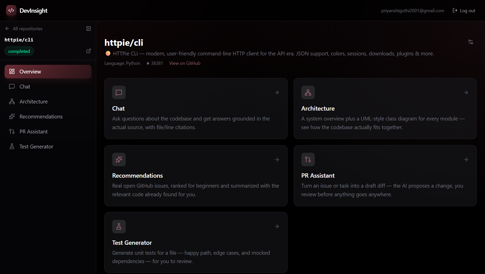
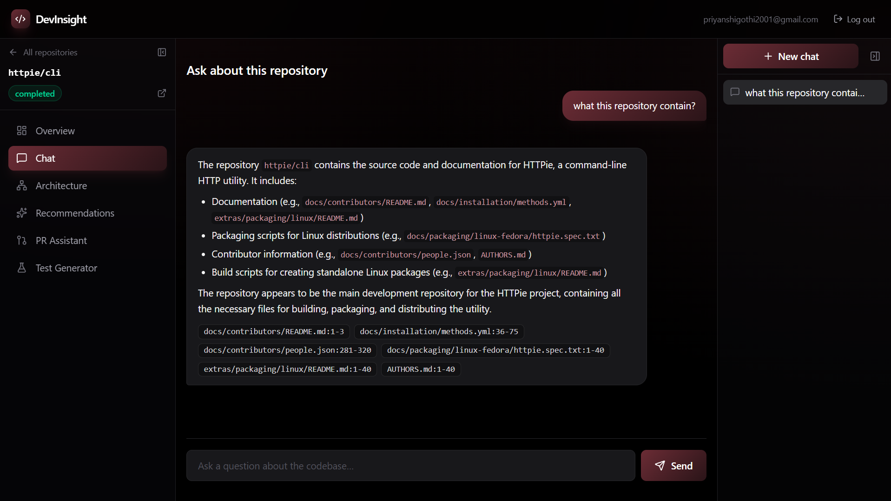
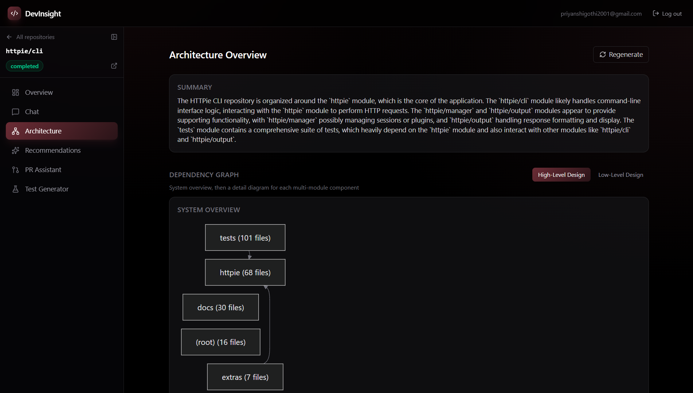
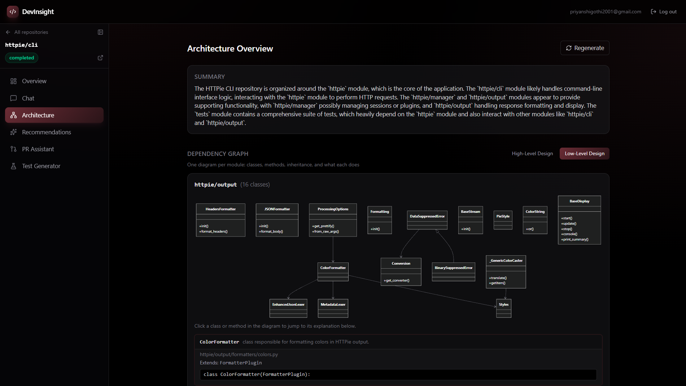
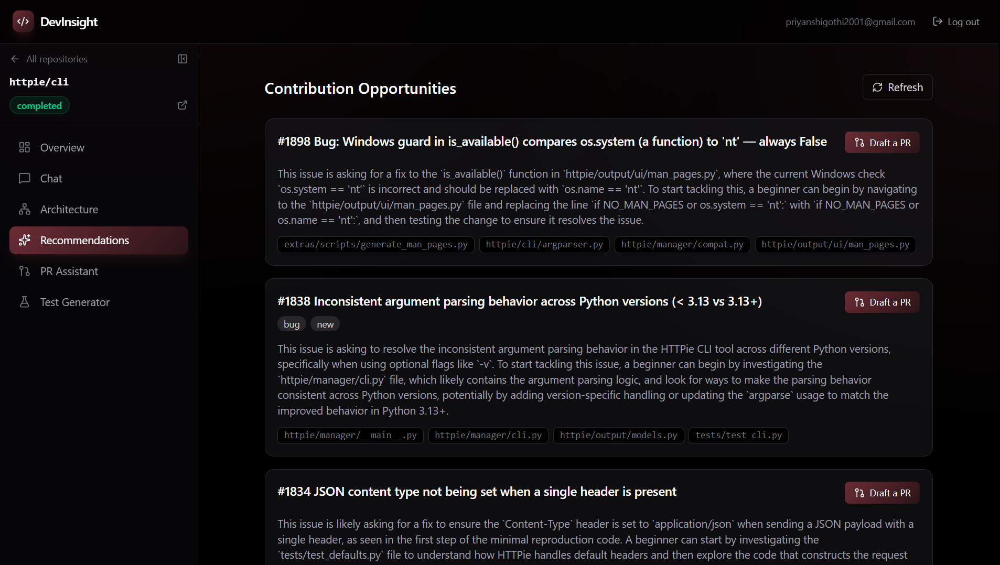
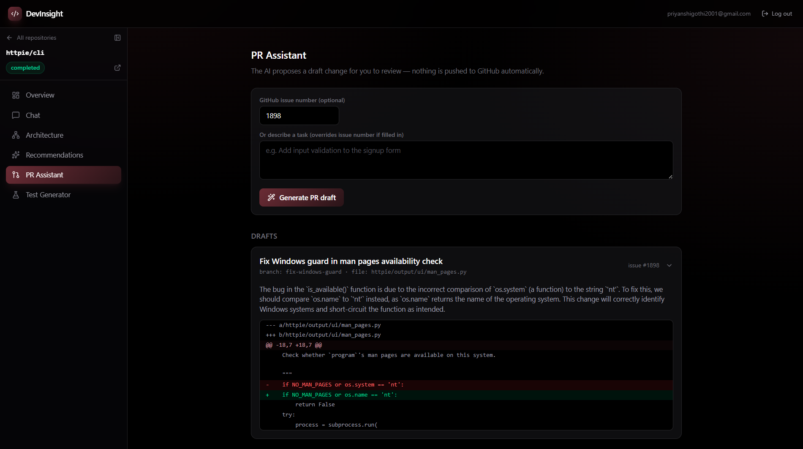
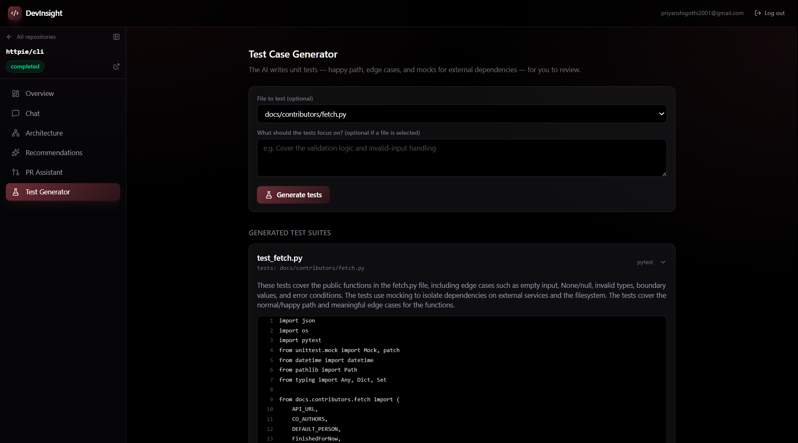
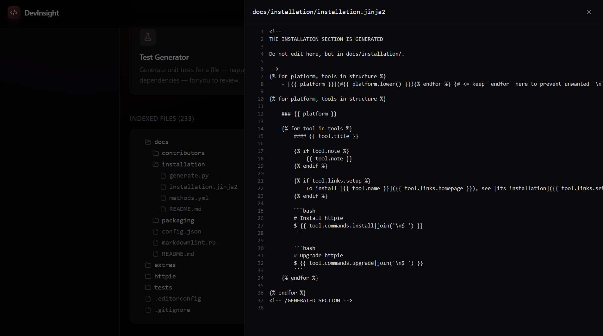
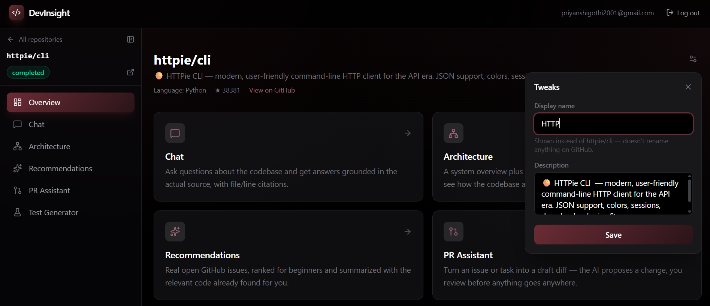

# DevInsight

An AI-powered assistant that ingests a public GitHub repository, indexes its code, and helps a
developer understand and contribute to it: RAG-based Q&A with citations, auto-generated
architecture diagrams, beginner-friendly contribution recommendations, AI-drafted pull requests,
and unit test generation.

**Backend:** Django + DRF, JWT auth, Postgres (pgvector) in production / SQLite + ChromaDB locally.
**Frontend:** React (Vite) + Tailwind CSS.
**Chat completions:** Groq (OpenAI-compatible). **Embeddings:** free local model (`fastembed`) by
default, or OpenAI's embeddings API.



## Features

- **Ingestion**: paste a public GitHub repo URL → downloads it, chunks the source files, embeds
  them in bounded batches, and stores the vectors — locally in ChromaDB during development, or in
  Postgres via the `pgvector` extension in production so the index survives redeploys. Live status
  (`pending → fetching → chunking → embedding → completed`) is shown in the UI.
- **Chat (RAG)**: ask natural-language questions about the repo; answers are grounded in retrieved
  code chunks and cite the exact file/line ranges. Each repo keeps its own chat sessions —
  switchable, deletable, and rendered as real markdown so copy/paste preserves formatting.
- **Architecture diagrams**: parses import/require statements to build a module dependency graph.
  A high-level overview shows how top-level directories depend on each other; switching to
  low-level design renders a UML-style class diagram per module (classes, methods, and an
  explanation of each, sourced straight from the indexed code) — plus an AI-written summary of
  the whole system.
- **Contribution recommendations**: pulls real open issues from GitHub (preferring `good first
  issue`/`help wanted` labels), grounds each in relevant code, and summarizes it for a newcomer —
  including which files it thinks you'd need to touch.
- **PR draft assistant**: given an issue number or a task description, retrieves the most relevant
  file, has the AI propose a change, and produces a real unified diff for you to review — nothing
  is pushed to GitHub automatically.
- **Test case generator**: pick a file (or describe a task) and get a generated test suite — happy
  path, edge cases, and mocked dependencies — with an explanation of what's covered.
- **File browser**: every indexed file is listed in a searchable tree; click one to view its source
  in a read-only viewer, fetched fresh from GitHub.
- **Tweaks**: rename how a repo is displayed and add your own description, without touching
  anything on GitHub — purely cosmetic, local to your account.
- **Staleness detection**: on-demand check for whether a repo's default branch has moved past the
  commit that was actually indexed, with a one-click re-index. The GitHub call behind this is
  cached for 5 minutes per repo to stay well within GitHub's unauthenticated rate limit.
- **Auth**: email/password signup and login (JWT), plus OTP-based password reset — a 6-digit code
  emailed to you, verified on-site, no email links.

## Screenshots

<table>
<tr>
<td width="50%">

**Repository overview**


</td>
<td width="50%">

**Chat with citations**


</td>
</tr>
<tr>
<td width="50%">

**Architecture — high-level design**


</td>
<td width="50%">

**Architecture — low-level design**


</td>
</tr>
<tr>
<td width="50%">

**Contribution recommendations**


</td>
<td width="50%">

**PR draft assistant**


</td>
</tr>
<tr>
<td width="50%">

**Test case generator**


</td>
<td width="50%">

**File browser**


</td>
</tr>
<tr>
<td width="50%">

**Tweaks panel** — rename/describe a repo locally


</td>
<td width="50%"></td>
</tr>
</table>

## Project structure

```
DevInsight/
├── backend/                        Django + DRF API
│   ├── accounts/                   Signup/login (JWT), OTP-based password reset
│   │   ├── emails.py                 HTML + plaintext OTP email
│   │   ├── models.py                 PasswordResetOTP
│   │   ├── serializers.py
│   │   ├── urls.py
│   │   └── views.py
│   ├── repos/                      Repo ingestion, staleness, file browser
│   │   ├── management/commands/
│   │   ├── services/
│   │   │   ├── chunker.py            Walks the repo, splits files into overlapping chunks
│   │   │   ├── fetch.py               GitHub tarball download, metadata, raw file fetch
│   │   │   └── ingest.py              Orchestrates fetch → chunk → embed → store
│   │   ├── apps.py                   Resets stuck ingestion jobs on startup
│   │   ├── models.py                  Repository, IngestionJob
│   │   ├── serializers.py
│   │   ├── urls.py                    Also mounts chat/ and contrib/ routes
│   │   └── views.py
│   ├── chat/                       RAG chat sessions
│   │   ├── services/
│   │   │   └── rag.py                 Retrieval + grounded prompt + citations
│   │   ├── models.py                  ChatSession, ChatMessage
│   │   ├── serializers.py
│   │   └── views.py
│   ├── contrib/                    Architecture, recommendations, PR drafts, tests
│   │   ├── services/
│   │   │   ├── architecture.py        Module dependency graph → Mermaid
│   │   │   ├── github_issues.py       Fetches real open GitHub issues
│   │   │   ├── imports_parser.py      Per-language import parsing
│   │   │   ├── pr_draft.py            AI-proposed change → unified diff
│   │   │   ├── recommendations.py     Grounded, beginner-friendly issue summaries
│   │   │   └── test_generator.py      AI-generated test suites
│   │   ├── models.py                  ArchitectureSnapshot, TestSuiteDraft
│   │   ├── serializers.py
│   │   └── views.py
│   ├── vectorstore/                 Vector store abstraction
│   │   ├── chroma_backend.py          Local dev: file-based ChromaDB
│   │   ├── pg_backend.py              Production: Postgres + pgvector
│   │   ├── client.py                  Dispatches by database vendor
│   │   └── selection.py               Diverse top-k chunk selection
│   ├── llm/
│   │   └── client.py                  Chat completions + embeddings (local/OpenAI)
│   ├── config/                      Django project settings
│   │   ├── settings.py
│   │   ├── urls.py
│   │   └── wsgi.py
│   ├── Dockerfile
│   ├── gunicorn.conf.py
│   ├── manage.py
│   ├── requirements.txt
│   └── runtime.txt
│
├── frontend/                       React (Vite) + Tailwind SPA
│   └── src/
│       ├── api/
│       │   └── client.js              All backend API calls
│       ├── components/
│       │   ├── ChatBubble.jsx           Markdown-rendered chat messages
│       │   ├── CodeViewer.jsx           Read-only source viewer
│       │   ├── DiffViewer.jsx           Unified diff renderer
│       │   ├── FileTree.jsx             Indexed file browser
│       │   ├── MermaidDiagram.jsx       Renders architecture diagrams
│       │   ├── RequireAuth.jsx          Route guard
│       │   └── ...                      Sidebar, TopBar, StatusBadge, AuthLayout, etc.
│       ├── context/
│       │   └── AuthContext.jsx
│       ├── layouts/
│       │   └── RepoLayout.jsx           Shared per-repo layout + ingestion polling
│       └── pages/
│           ├── Landing.jsx              Logged-out marketing page
│           ├── Home.jsx                 Dashboard — submit/browse repos
│           ├── Login.jsx / Signup.jsx / ForgotPassword.jsx
│           ├── RepoDashboard.jsx        Repo Overview + Tweaks panel
│           ├── Chat.jsx
│           ├── Architecture.jsx
│           ├── Recommendations.jsx
│           ├── PrAssistant.jsx
│           └── TestGenerator.jsx
│
└── docs/
    └── screenshots/
```

## Backend setup

```bash
cd backend
python -m venv venv
venv\Scripts\activate        # Windows
# source venv/bin/activate   # macOS/Linux
pip install -r requirements.txt
copy .env.example .env       # Windows: copy, macOS/Linux: cp
```

Edit `backend/.env`:

- **Database** — defaults to a local SQLite file, no setup needed. In production, set
  `DATABASE_URL` to a real Postgres connection string (e.g. from [Neon](https://neon.tech)'s free
  tier) so data survives redeploys — a Web Service's local disk doesn't.
- **Chat completions** — any OpenAI-compatible API works. Two easy options are documented inline in
  `.env.example`:
  - **Groq** (free tier, fast): get a key at https://console.groq.com/keys, set `LLM_API_KEY`,
    `LLM_BASE_URL=https://api.groq.com/openai/v1`, `LLM_CHAT_MODEL=llama-3.3-70b-versatile`.
  - **OpenAI**: get a key at https://platform.openai.com/api-keys, set `LLM_API_KEY`, leave
    `LLM_BASE_URL` empty, `LLM_CHAT_MODEL=gpt-4o-mini`.

  Prompt sizes (`RAG_TOP_K`, chat history length, PR-draft file size cap) default to conservative
  values tuned to fit under Groq's free-tier rate limit (12,000 tokens/minute, shared across the
  whole app) — see `RAG_TOP_K` and `MAX_PR_FILE_SIZE_BYTES` in `config/settings.py`. If you're on
  a paid tier or a provider with a higher limit, raise them via `.env` for better answer quality.
- **Embeddings** — defaults to `EMBEDDING_PROVIDER=local`, which runs a free ONNX model
  (`fastembed`, no torch dependency) on CPU with no API key or billing at all. (Groq has no
  embeddings endpoint, so embeddings stay local even when chat uses Groq.) Set
  `EMBEDDING_PROVIDER=openai` instead to use OpenAI's embeddings API, which requires
  `OPENAI_API_KEY` — vectors are stored as fixed-width columns in Postgres, so switching providers
  in production requires re-indexing existing repos.
- **Password reset email** — defaults to printing the OTP email to the console, zero setup for
  local dev. For real delivery, switch to the SMTP backend and fill in the `EMAIL_HOST_*` vars
  (Gmail SMTP, SendGrid, Mailgun, etc.) — see the inline comments in `.env.example`.
- `GITHUB_TOKEN` is optional and only needed if you hit GitHub's unauthenticated API rate limit
  (60 requests/hour; a token raises it to 5,000/hour).

```bash
python manage.py migrate
python manage.py runserver
```

The API is served at `http://localhost:8000/api/`. The first request that needs embeddings will
download the local model (~90MB, one-time, cached under your home directory).

### Running the backend with Docker

An alternative to the venv setup above — a multi-stage `backend/Dockerfile` builds a slim,
non-root runtime image:

```bash
docker build -t devinsight-backend backend/
docker run --rm -p 10000:10000 --env-file backend/.env devinsight-backend
```

The API is then served at `http://localhost:10000/api/`. This is unrelated to how the app is
actually deployed (see [Deployment](#deployment)) — it's a self-contained way to build and run
the backend without a local Python environment, e.g. for testing on another machine or platform.

## Frontend setup

```bash
cd frontend
npm install
copy .env.example .env       # Windows: copy, macOS/Linux: cp
npm run dev
```

The app is served at `http://localhost:5173`. It talks to the backend at the URL configured in
`frontend/.env` (`VITE_API_BASE_URL`, defaults to `http://localhost:8000/api`).

## How it works

1. **Ingestion** (`repos/services/`): `fetch.py` resolves the GitHub URL and downloads a tarball via
   GitHub's public codeload endpoint (no `git` binary or auth needed for public repos). `chunker.py`
   walks the tree, skips binary/vendor/lockfile noise, and splits text files into overlapping
   ~40-line chunks. `ingest.py` orchestrates the pipeline in a background thread: chunks and embeds
   in bounded batches (flushed to the vector store as it goes, rather than holding an entire repo's
   text in memory at once), and stores vectors via `vectorstore/client.py`, which dispatches to a
   ChromaDB-backed store locally (SQLite dev) or a Postgres/`pgvector`-backed store in production
   (detected automatically from the database connection). Progress is tracked via
   `Repository.status`, polled by the frontend every few seconds. If the server restarts
   mid-ingestion, `repos/apps.py` resets any stuck job to `failed` on startup.
2. **Chat/RAG** (`chat/services/rag.py`): embeds the user's question, retrieves the top-k similar
   chunks for the repo, builds a grounded prompt (with recent chat history), and calls the chat
   completion API. Returns the answer plus citations (`file_path`, `start_line`, `end_line`). Each
   conversation is a `ChatSession`, so a repo can have multiple, independently switchable threads.
3. **Architecture** (`contrib/services/architecture.py`, `imports_parser.py`): reads each file's
   first indexed chunk (where imports live) straight from the vector store — no repo re-download
   needed — parses imports per language, resolves internal-only edges, aggregates to a module-level
   graph, and renders Mermaid. The AI summary is best-effort and degrades gracefully if the chat API
   fails.
4. **Recommendations** (`contrib/services/recommendations.py`, `github_issues.py`): fetches real
   open GitHub issues, prefers beginner-friendly labels with a fallback to recent issues, and asks
   the AI for a grounded summary per issue (also best-effort/gracefully degrading).
5. **PR drafts** (`contrib/services/pr_draft.py`): RAG-retrieves the most relevant file for a task,
   re-downloads the repo to read that file's pristine original content, has the AI propose a full
   replacement via a structured prompt, and computes a real unified diff with `difflib`.
6. **Test generation** (`contrib/services/test_generator.py`): RAG-picks a target file (or uses an
   explicit one), fetches its raw source, and asks the AI for a structured response — explanation,
   framework, file name, and test code — covering the happy path, edge cases, and mocked
   dependencies.
7. **Password reset** (`accounts/`): a `PasswordResetOTP` model generates a 6-digit code with a
   10-minute expiry. The frontend flow is three explicit steps — request a code, verify it (without
   consuming it, so a wrong entry doesn't burn the real code), then set a new password — with an
   HTML-formatted email (`accounts/emails.py`).

## Deployment

This app is deployed as three separate free-tier services:

- **Backend**: [Render](https://render.com) Web Service (`gunicorn config.wsgi`), Root Directory
  `backend`, Python pinned via `runtime.txt`.
- **Frontend**: [Vercel](https://vercel.com), with `frontend/vercel.json` providing the SPA
  rewrite rule client-side routes need on reload.
- **Database**: [Neon](https://neon.tech) serverless Postgres (with the `pgvector` extension for
  the embedding index), so data survives every backend redeploy.

See `backend/.env.example` for the full list of environment variables each service needs.

## Notes / production considerations

- Ingestion runs on a plain Python thread for simplicity — swap in Celery + Redis/RabbitMQ if you
  need retries, multi-worker scaling, or to survive server restarts mid-ingestion.
- Local embeddings (`fastembed`) are memory-light compared to a full `torch`-based model, but a
  512MB-RAM host still has very little headroom once the model is loaded — large repos may need a
  bigger instance, or `EMBEDDING_PROVIDER=openai`, to index reliably.
- Rotate any credentials (API keys, `SECRET_KEY`, email app passwords) that have ever been shared
  or committed anywhere outside your own `.env`/host dashboard.
- No dedicated cache layer (Redis, etc.) — Architecture and Recommendations are cached by simply
  persisting the generated result and only recomputing on an explicit "Regenerate"/"Refresh", and
  the staleness check uses Django's default in-memory cache for a short TTL. Fine for a single
  gunicorn worker; a multi-worker or multi-instance deployment would need a shared backend
  (Redis, Memcached) instead, since in-memory cache isn't shared across processes.

## Contributing

Open to contributions — bug fixes, new features, or just cleanup. Fork the repo, make your
changes, and open a pull request.

## Author

**Priyanshi** — [GitHub](https://github.com/Priyanshi-06)
